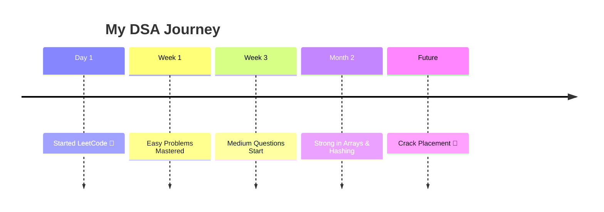
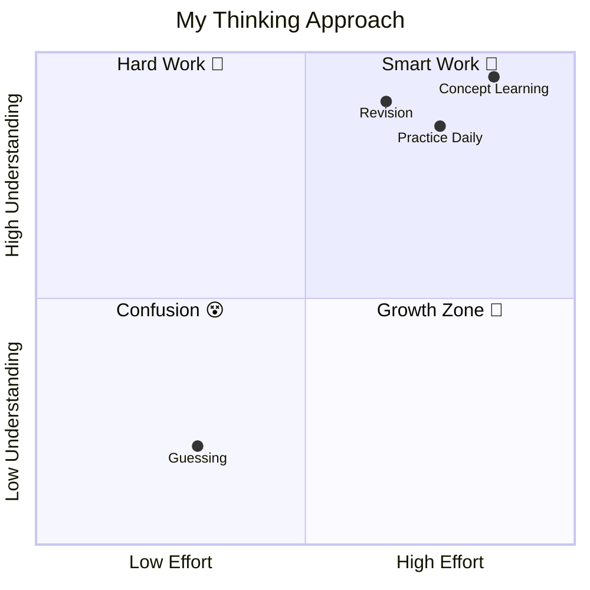

<div align="center">

# 💻✨ LeetCode Practice Journey

### 🚀 Building Logic Daily | DSA + Consistency


</div>

---

## 🕒 📅 Learning Timeline



---

## 🧠 📊 Problem Solving Mindset



---

## 📦 🗂️ Repository Structure

```bash
Leetcode-Practice/
├── 0001-two-sum/
├── 0004-median-of-two-sorted-arrays/
├── 0268-missing-number/
├── 0509-fibonacci-number/
└── ...
```

---

## 🧩 📊 Skills Overview

```mermaid
radar
    title Coding Strength
    Arrays : 80
    Strings : 70
    Hashing : 75
    Recursion : 60
    DP : 40
```

---

## 🔺 📈 Growth Pyramid

```mermaid
pyramid
    title My Growth Path
    "Consistency 🔥" : 100
    "Practice 💻" : 80
    "Concept Clarity 🧠" : 60
    "Speed ⚡" : 40
    "Mastery 🏆" : 20
```

---

## 📊 🚀 GitHub Stats

<div align="center">


</div>


<div align="center">

⭐ If you like this repo, give it a star — it motivates me!

</div>
