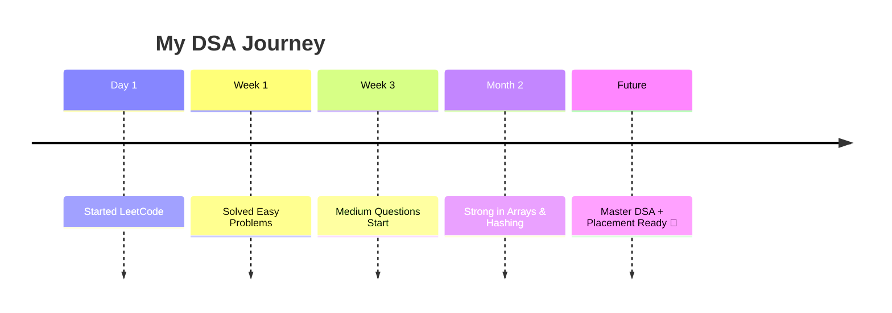
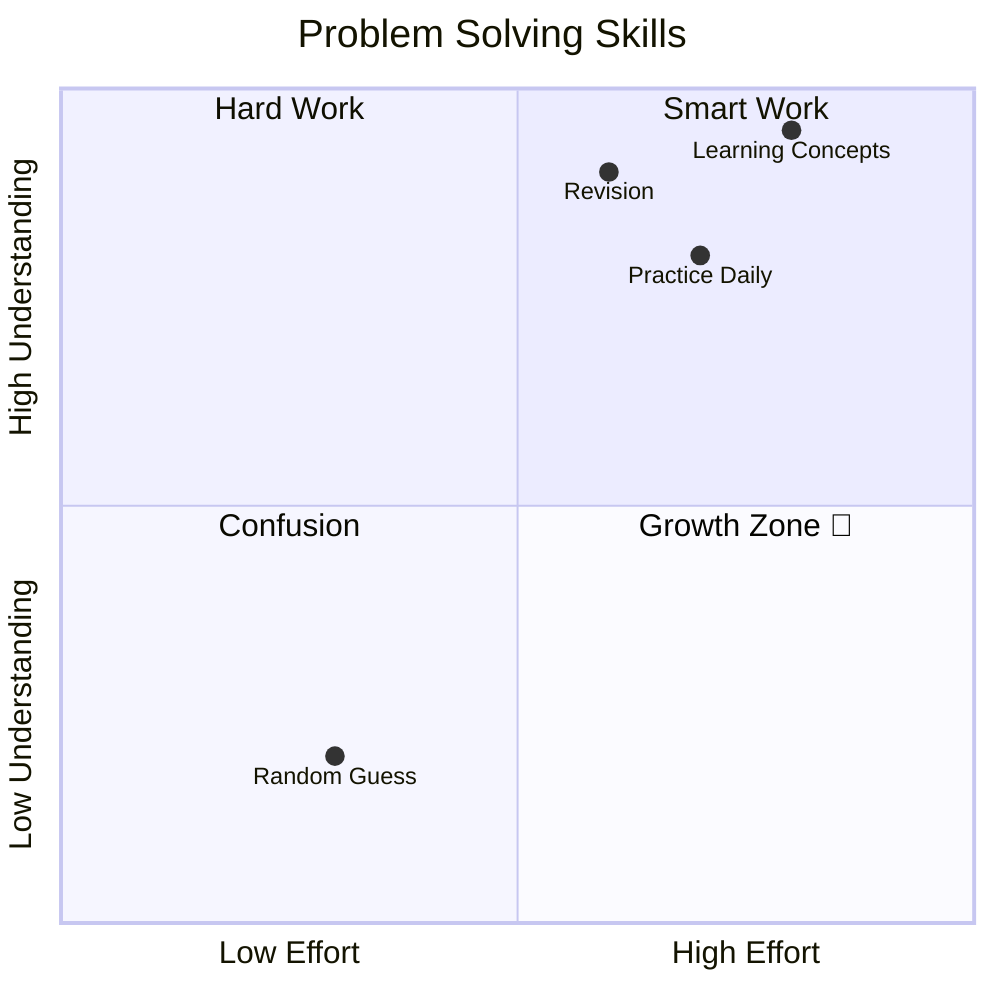

# 💻✨ LeetCode Practice Journey

<h3 align="center">🚀 Building Logic Daily | DSA + Consistency</h3>

---

## 🕒 📅 Learning Timeline (Unique Look)



---

## 🧠 📊 Problem Solving Quadrant



---

## 📦 🗂️ Repository Structure

```bash
Leetcode-Practice/
├── 0001-two-sum/
├── 0004-median-of-two-sorted-arrays/
├── 0268-missing-number/
├── 0509-fibonacci-number/
└── ...
```

---

## 🧩 🧠 Skills Radar (Different Style)

```mermaid
radar
    title Coding Skills
    Arrays : 80
    Strings : 70
    Hashing : 75
    Recursion : 60
    DP : 40
```

---

## 🔺 📈 Growth Pyramid

```mermaid
pyramid
    title Learning Growth
    "Consistency" : 100
    "Practice" : 80
    "Concept Clarity" : 60
    "Speed" : 40
    "Mastery" : 20
```


⭐ Star this repo if you like my journey!
