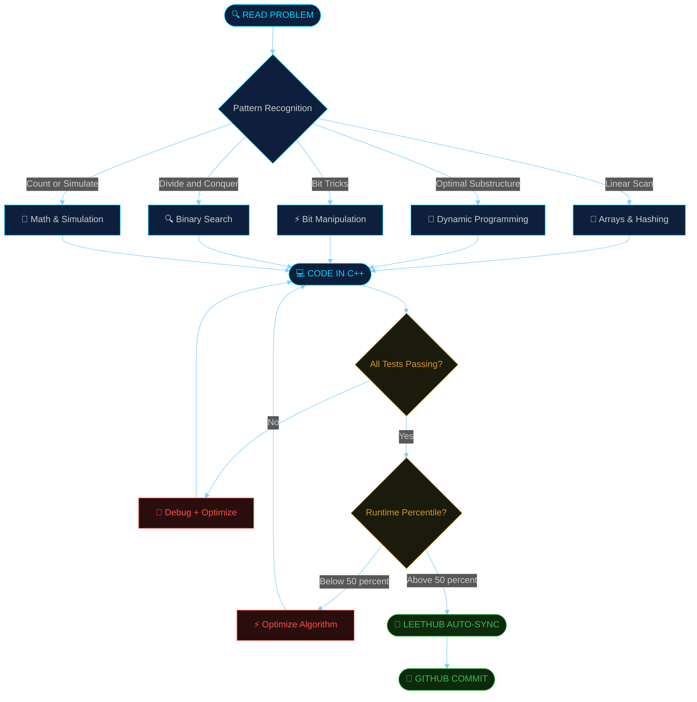
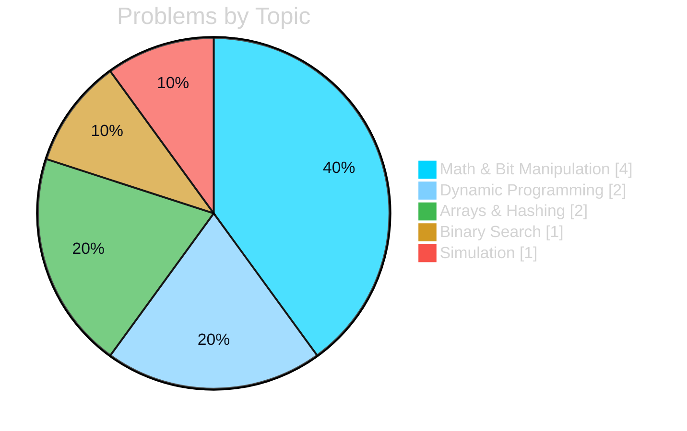
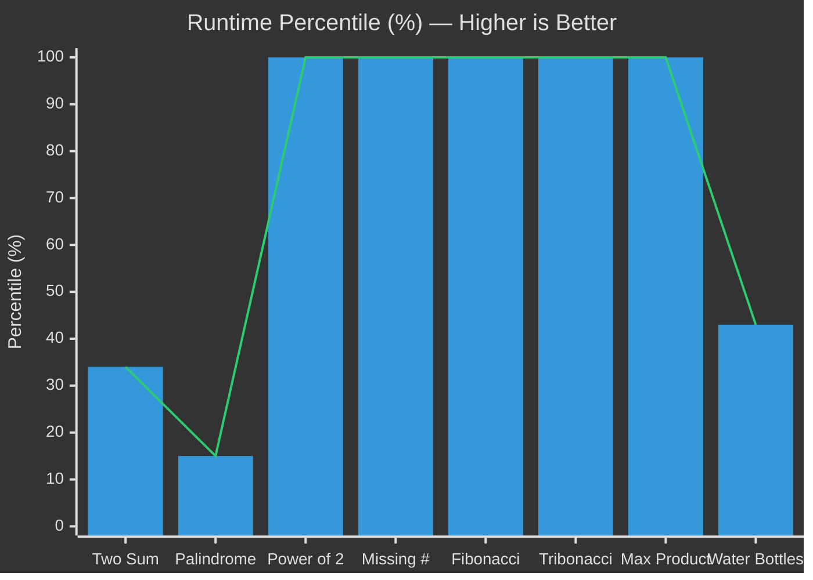
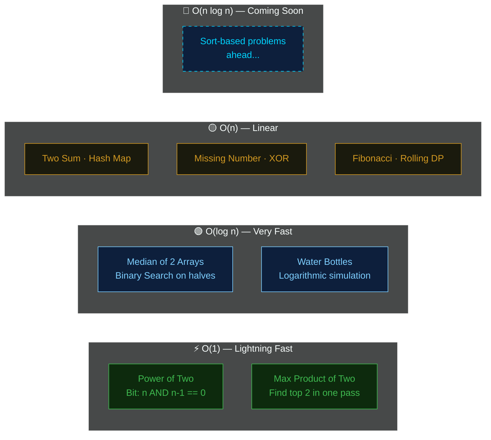
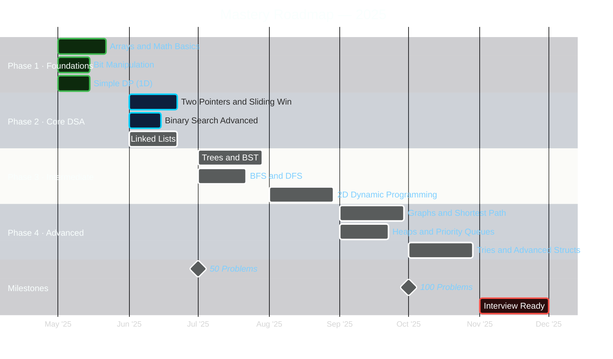

<div align="center">

<!-- ═══════════════════════════════════════════════ -->
<!--              ANIMATED HEADER BANNER             -->
<!-- ═══════════════════════════════════════════════ -->


<!-- TYPING ANIMATION -->
<a href="https://git.io/typing-svg">
  
</a>

<br/><br/>

[](https://github.com/simranmaran)
[](https://isocpp.org/)
[](https://leetcode.com)
[](https://github.com/QasimWani/LeetHub)


</div>

<br/>

---

## 📊 Dashboard

<div align="center">

<table>
<tr>
<td align="center" width="200">

### 🟢 Easy
# 7
`solved`

</td>
<td align="center" width="200">

### 🟡 Medium
# 2
`solved`

</td>
<td align="center" width="200">

### 🔴 Hard
# 1
`solved`

</td>
<td align="center" width="200">

### ⚡ Perfect
# 5
`0 ms runtime`

</td>
</tr>
</table>

</div>

<br/>

---

## 🧠 Problem-Solving Methodology



<br/>

---

## 📋 Solutions Archive

<div align="center">

| # | Problem | Difficulty | Topic | Time | Space | Runtime | Memory | Rank |
|:---:|:--------|:----------:|:-----:|:----:|:-----:|:-------:|:------:|:----:|
| [0001](./0001-two-sum/) | **Two Sum** | 🟢 Easy | `Hash Map` | O(n) | O(n) | 35 ms | 14.1 MB | 34.74% |
| [0004](./0004-median-of-two-sorted-arrays/) | **Median of Two Sorted Arrays** | 🔴 Hard | `Binary Search` | O(log n) | O(1) | 3 ms | 96 MB | 27.93% |
| [0009](./0009-palindrome-number/) | **Palindrome Number** | 🟢 Easy | `Math` | O(log n) | O(1) | 7 ms | 8.4 MB | 15.02% |
| [0231](./0231-power-of-two/) | **Power of Two** | 🟢 Easy | `Bit Manip` | O(1) | O(1) | **0 ms 🏆** | 7.8 MB | **100%** |
| [0268](./0268-missing-number/) | **Missing Number** | 🟢 Easy | `XOR / Math` | O(n) | O(1) | **0 ms 🏆** | 21.8 MB | **100%** |
| [0509](./0509-fibonacci-number/) | **Fibonacci Number** | 🟢 Easy | `DP` | O(n) | O(1) | **0 ms 🏆** | 7.8 MB | **100%** |
| [0989](./0989-add-to-array-form-of-integer/) | **Add to Array-Form of Integer** | 🟢 Easy | `Array + Math` | O(n) | O(n) | 8 ms | 32.6 MB | 5.71% |
| [1137](./1137-n-th-tribonacci-number/) | **N-th Tribonacci Number** | 🟢 Easy | `DP` | O(n) | O(1) | **0 ms 🏆** | 7.9 MB | **100%** |
| [1464](./1464-maximum-product-of-two-elements-in-an-array/) | **Maximum Product of Two Elements** | 🟢 Easy | `Greedy` | O(n) | O(1) | **0 ms 🏆** | 13.3 MB | **100%** |
| [1518](./1518-water-bottles/) | **Water Bottles** | 🟡 Medium | `Simulation` | O(log n) | O(1) | 0 ms | 7.8 MB | 43.31% |

</div>

<br/>

---

## 🗂️ Topic Distribution



<br/>

---

## ⚡ Runtime Performance



<br/>

---

## 🧮 Complexity Reference



<br/>

---

## 🗓️ 2025 DSA Roadmap



<br/>

---

## 🚀 Quick Start

```bash
# ── Clone the repository ─────────────────────────────────────
git clone https://github.com/simranmaran/Leetcode-Practice.git
cd Leetcode-Practice

# ── Compile and run any solution ─────────────────────────────
cd 0001-two-sum
g++ -O2 -std=c++17 -o solution solution.cpp && ./solution

# ── With debug flags ─────────────────────────────────────────
g++ -g -Wall -Wextra -std=c++17 -o solution solution.cpp
```

> 💡 Each folder contains a `.cpp` solution file, auto-synced by [LeetHub](https://github.com/QasimWani/LeetHub)

<br/>

---

## 🛠️ Tech Stack

<div align="center">


</div>

**C++ features used across solutions:**
- `unordered_map` / `unordered_set` — O(1) average lookups
- Bit operations — `n & (n-1)`, XOR tricks, `__builtin_popcount()`
- STL algorithms — `sort()`, `min_element()`, `max_element()`
- DP with rolling variables — space-optimized Fibonacci, Tribonacci

<br/>

---

## 📈 GitHub Stats

<div align="center">


&nbsp;&nbsp;


<br/><br/>


</div>

<br/>

---

<div align="center">

```
╔══════════════════════════════════════════════════════════════╗
║                                                              ║
║     "First, solve the problem. Then, write the code."        ║
║                                          — John Johnson      ║
║                                                              ║
╚══════════════════════════════════════════════════════════════╝
```


**Auto-synced with [LeetHub](https://github.com/QasimWani/LeetHub) · Built with ❤️ by [@simranmaran](https://github.com/simranmaran)**


[](https://github.com/simranmaran/Leetcode-Practice/stargazers)
[](https://github.com/simranmaran/Leetcode-Practice/commits)

</div>
Explain
