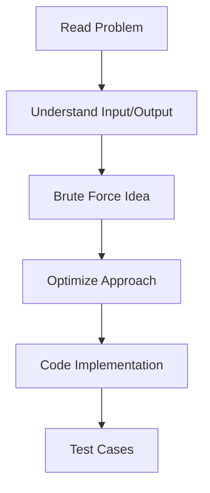
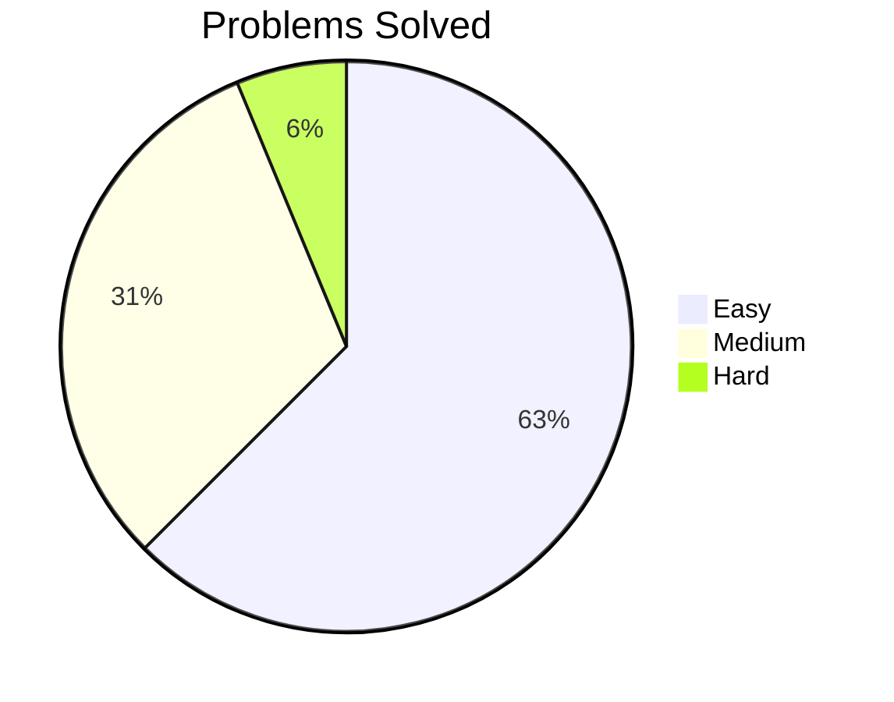
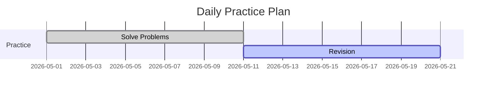

# 🚀 LeetCode Practice Journey

<h3 align="center">💡 Turning Logic into Code | Daily DSA Practice</h3>

---

## 📊 📈 My Coding Flow (Diagram)


---

## 📌 About This Repository

✨ This repository contains my daily LeetCode problem-solving journey.

✔️ Practicing Data Structures & Algorithms
✔️ Building strong logic for coding interviews
✔️ Maintaining consistency every day

---

## 🧠 Problem Solving Strategy (Visual)



---

## 📂 Repository Structure

```bash
Leetcode-Practice/
│
├── 0001-two-sum/
├── 0004-median-of-two-sorted-arrays/
├── 0268-missing-number/
├── 0509-fibonacci-number/
└── ...
```

---

## 🔥 Topics Covered

🟢 Arrays
🟢 Strings
🟢 Hashing
🟢 Two Pointers
🟢 Recursion
🟡 Dynamic Programming (Coming Soon...)

---

## 📈 Progress Tracker



---


## 📅 Consistency Tracker



---


⭐ Star this repo if you like my journey!
